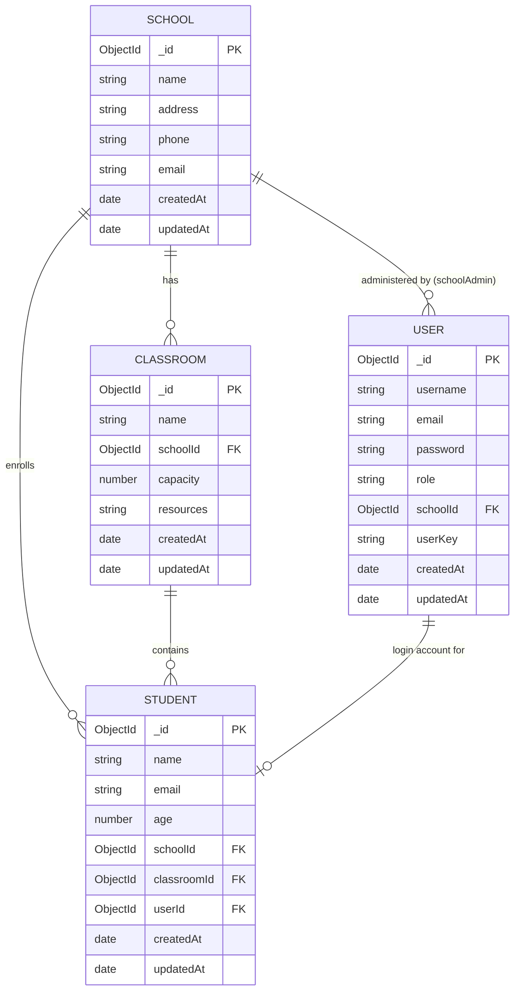

# School Management System API

A RESTful API for managing schools, classrooms, and students. Built on the [Axion](https://github.com/qantra-io/axion) Node.js framework template.

---

## Tech Stack

- **Runtime**: Node.js + Express
- **Database**: MongoDB (Mongoose)
- **Cache / Pub-sub**: Redis (Oyster, Cortex)
- **Auth**: JWT (long-lived tokens)
- **Security**: bcrypt passwords, role-based access control, rate limiting

---

## Setup

### Prerequisites

- Node.js 18+
- MongoDB
- Redis

### Install

```bash
npm install
```

### Configure environment

```bash
cp .env.example .env
# edit .env with your values
```

Required variables:

| Variable             | Description                                 |
| -------------------- | ------------------------------------------- |
| `MONGO_URI`          | MongoDB connection string                   |
| `CACHE_REDIS`        | Redis URL for cache                         |
| `CORTEX_REDIS`       | Redis URL for Cortex pub-sub                |
| `OYSTER_REDIS`       | Redis URL for Oyster                        |
| `LONG_TOKEN_SECRET`  | Secret for signing long-lived JWTs          |
| `SHORT_TOKEN_SECRET` | Secret for signing short-lived JWTs         |
| `NACL_SECRET`        | Encryption secret                           |
| `ADMIN_SECRET`       | One-time secret to bootstrap the superadmin |

### Start

```bash
npm start
```

Server runs on port `5111` by default (`USER_PORT` env var).

### Test

```bash
npm test
```

Tests use an in-memory MongoDB instance (`MongoMemoryServer`) — no external database required.

---

## Authentication Flow

1. **Bootstrap superadmin** (one-time):

   ```
   POST /api/user/createSuperAdmin
   { "adminSecret": "<ADMIN_SECRET>", "username": "...", "email": "...", "password": "..." }
   ```

2. **Login** (any role):

   ```
   POST /api/user/loginUser
   { "email": "...", "password": "..." }
   => { "ok": true, "data": { "longToken": "<JWT>", "role": "..." } }
   ```

3. **Authenticate requests** — pass the token in the `Authorization` header:
   ```
   Authorization: Bearer <longToken>
   ```

---

## Roles

| Role          | Access                                                                     |
| ------------- | -------------------------------------------------------------------------- |
| `superadmin`  | Full system access — manages schools and school admins                     |
| `schoolAdmin` | School-scoped access — manages classrooms and students within their school |
| `student`     | Read-only access to their own profile                                      |

---

## API Endpoints

All endpoints follow the pattern: `METHOD /api/<module>/<function>`

### User

| Method | Endpoint                     | Auth                        | Description                |
| ------ | ---------------------------- | --------------------------- | -------------------------- |
| POST   | `/api/user/createSuperAdmin` | None (ADMIN_SECRET in body) | Bootstrap first superadmin |
| POST   | `/api/user/loginUser`        | None                        | Login, returns longToken   |

### Schools

| Method | Endpoint                                 | Auth       | Description                                                                                          |
| ------ | ---------------------------------------- | ---------- | ---------------------------------------------------------------------------------------------------- |
| POST   | `/api/school/createSchool`               | superadmin | Create a school                                                                                      |
| GET    | `/api/school/getSchool?id=<id>`          | superadmin | Get school by ID                                                                                     |
| GET    | `/api/school/listSchools?page=&limit=`   | superadmin | List all schools (paginated)                                                                         |
| PUT    | `/api/school/updateSchool`               | superadmin | Update school fields                                                                                 |
| DELETE | `/api/school/deleteSchool`               | superadmin | Delete a school (cascades: removes all classrooms and school admin accounts; students are preserved) |
| POST   | `/api/school/createSchoolAdmin`          | superadmin | Create a school admin for a school                                                                   |
| GET    | `/api/school/listSchoolAdmins?schoolId=` | superadmin | List admins for a school (paginated)                                                                 |

### Classrooms

| Method | Endpoint                                     | Auth        | Description                                   |
| ------ | -------------------------------------------- | ----------- | --------------------------------------------- |
| POST   | `/api/classroom/createClassroom`             | schoolAdmin | Create a classroom in admin's school          |
| GET    | `/api/classroom/getClassroom?id=<id>`        | schoolAdmin | Get classroom by ID                           |
| GET    | `/api/classroom/listClassrooms?page=&limit=` | schoolAdmin | List classrooms (scoped to school, paginated) |
| PUT    | `/api/classroom/updateClassroom`             | schoolAdmin | Update classroom fields                       |
| DELETE | `/api/classroom/deleteClassroom`             | schoolAdmin | Delete a classroom                            |

### Students

| Method | Endpoint                                              | Auth        | Description                                                          |
| ------ | ----------------------------------------------------- | ----------- | -------------------------------------------------------------------- |
| POST   | `/api/student/createStudent`                          | schoolAdmin | Create student + linked user account                                 |
| GET    | `/api/student/getStudent?id=<id>`                     | schoolAdmin | Get student by ID                                                    |
| GET    | `/api/student/listStudents?classroomId=&page=&limit=` | schoolAdmin | List students (scoped to school, paginated, filterable by classroom) |
| PUT    | `/api/student/updateStudent`                          | schoolAdmin | Update student profile (name, age, classroomId)                      |
| DELETE | `/api/student/deleteStudent`                          | schoolAdmin | Delete student + user account                                        |
| PUT    | `/api/student/transferStudent`                        | schoolAdmin | Transfer student to another school/classroom                         |
| GET    | `/api/student/myProfile`                              | student     | Student views their own profile                                      |
| PUT    | `/api/student/changePassword`                         | student     | Student changes their own password                                   |

---

## Request / Response Format

All responses follow this structure:

```json
{
  "ok": true,
  "data": { ... },
  "errors": [],
  "message": ""
}
```

On error:

```json
{
  "ok": false,
  "data": {},
  "errors": "...",
  "message": "description of error"
}
```

### Pagination

All `list*` endpoints accept optional query parameters:

| Parameter | Default | Max   | Description           |
| --------- | ------- | ----- | --------------------- |
| `page`    | `1`     | —     | Page number (1-based) |
| `limit`   | `20`    | `100` | Results per page      |

Paginated responses include a `pagination` object:

```json
{
  "ok": true,
  "data": {
    "items": [...],
    "pagination": { "total": 42, "page": 1, "limit": 20, "totalPages": 3 }
  }
}
```

### Request Field Reference

Fields marked **\*** are required.

**createSchool / updateSchool**

| Field     | Type   | Notes       |
| --------- | ------ | ----------- |
| `name` \* | string | 3–100 chars |
| `address` | string |             |
| `phone`   | string |             |
| `email`   | string |             |

**createSchoolAdmin** (requires schoolId in body)

| Field         | Type     | Notes                       |
| ------------- | -------- | --------------------------- |
| `schoolId` \* | ObjectId | School to assign admin to   |
| `username` \* | string   | 3–20 chars, globally unique |
| `email` \*    | string   | globally unique             |
| `password` \* | string   | min 8 chars                 |

**createClassroom / updateClassroom**

| Field         | Type   | Notes                     |
| ------------- | ------ | ------------------------- |
| `name` \*     | string | unique within the school  |
| `capacity` \* | number | 1–1000                    |
| `resources`   | string | max 500 chars (free-text) |

**createStudent**

| Field         | Type     | Notes                         |
| ------------- | -------- | ----------------------------- |
| `name` \*     | string   | 2–100 chars                   |
| `email` \*    | string   | globally unique               |
| `username` \* | string   | globally unique               |
| `password` \* | string   | min 8 chars                   |
| `age`         | number   | 3–100                         |
| `classroomId` | ObjectId | must belong to admin's school |

**updateStudent**

| Field         | Type     | Notes                                    |
| ------------- | -------- | ---------------------------------------- |
| `id` \*       | ObjectId | student to update                        |
| `name`        | string   |                                          |
| `age`         | number   |                                          |
| `classroomId` | ObjectId | set to `null` to unassign from classroom |

**transferStudent**

| Field               | Type     | Notes                        |
| ------------------- | -------- | ---------------------------- |
| `studentId` \*      | ObjectId |                              |
| `targetSchoolId` \* | ObjectId |                              |
| `targetClassroomId` | ObjectId | must belong to target school |

---

### Example: Create School

**Request**

```
POST /api/school/createSchool
Authorization: Bearer <superadmin longToken>

{
  "name": "Lincoln High School",
  "address": "123 Main Street",
  "phone": "555-1234",
  "email": "info@lincoln.edu"
}
```

**Response**

```json
{
  "ok": true,
  "data": {
    "school": {
      "_id": "...",
      "name": "Lincoln High School",
      "address": "123 Main Street",
      "phone": "555-1234",
      "email": "info@lincoln.edu",
      "createdAt": "...",
      "updatedAt": "..."
    }
  }
}
```

### Example: Transfer Student

**Request**

```
PUT /api/student/transferStudent
Authorization: Bearer <schoolAdmin longToken>

{
  "studentId": "<student id>",
  "targetSchoolId": "<target school id>",
  "targetClassroomId": "<optional target classroom id>"
}
```

---

## Database Schema



> **Note on deletion:** Deleting a school cascades — all its classrooms and school admin accounts are deleted atomically in the same transaction. Students are preserved (their `schoolId` field will reference a deleted school). Deleting a classroom does not unassign enrolled students.

### Indexes

| Collection | Index                         | Purpose                                            |
| ---------- | ----------------------------- | -------------------------------------------------- |
| User       | `role`                        | Role-based queries                                 |
| User       | `schoolId`                    | School-scoped user lookups                         |
| User       | `userKey`                     | Token validation on cache miss                     |
| User       | `{ schoolId, role }` compound | Covers `listSchoolAdmins` filter efficiently       |
| Classroom  | `schoolId`                    | School-scoped classroom queries                    |
| Classroom  | `{ schoolId, name }` unique   | Prevents duplicate classroom names within a school |
| Student    | `schoolId`                    | School-scoped student queries                      |
| Student    | `classroomId`                 | Classroom-scoped student queries                   |
| Student    | `userId`                      | Student ↔ User account join                        |

---

## Data Integrity

Several operations write to more than one collection. These are currently executed as sequential operations without a transaction:

| Operation         | Collections written                      | Risk without a transaction                                                                  |
| ----------------- | ---------------------------------------- | ------------------------------------------------------------------------------------------- |
| `deleteSchool`    | school → classrooms → school admin users | classrooms or admins may not be deleted if the process crashes mid-way                      |
| `createStudent`   | user account → student record            | a user account can be created without a student record if the second write fails            |
| `deleteStudent`   | student record → user account            | the user login account may survive if the student delete succeeds but the user delete fails |
| `transferStudent` | student.schoolId → user.schoolId         | the student and their login account can end up pointing at different schools                |

If you need full atomicity, run MongoDB as a replica set and wrap these operations in `mongoose.startSession()` / `session.startTransaction()`. A standalone MongoDB instance does not support multi-document transactions.

---

## Security

- Passwords hashed with bcrypt (10 rounds)
- JWT tokens signed with configurable secrets; 30-day expiry with `userKey` rotation on password change (old tokens invalidated)
- Per-request token validation: every authenticated request verifies the token's `userKey` against a Redis cache (with automatic fallback to MongoDB on cache miss or Redis unavailability) — ensures tokens are invalidated immediately on password change
- Standard `Authorization: Bearer <token>` header
- Security headers via `helmet` (X-Content-Type-Options, X-Frame-Options, HSTS, etc.)
- Role-based access control enforced at middleware layer
- CORS restricted to configured origins in production (`CORS_ORIGINS`)
- Rate limiting: 100 req / 15 min globally; 10 req / 15 min on auth endpoints
- Request body size capped at 10kb
- Startup secret validation: server refuses to start if `LONG_TOKEN_SECRET`, `SHORT_TOKEN_SECRET`, `NACL_SECRET`, or `ADMIN_SECRET` are absent from the environment

---

## HTTP Status Codes

| Status | Meaning                                |
| ------ | -------------------------------------- |
| 200    | Success                                |
| 400    | Validation error or bad request        |
| 401    | Missing or invalid token               |
| 403    | Insufficient permissions for this role |
| 404    | Resource not found                     |
| 409    | Conflict — duplicate email or username |
| 500    | Internal server error                  |
